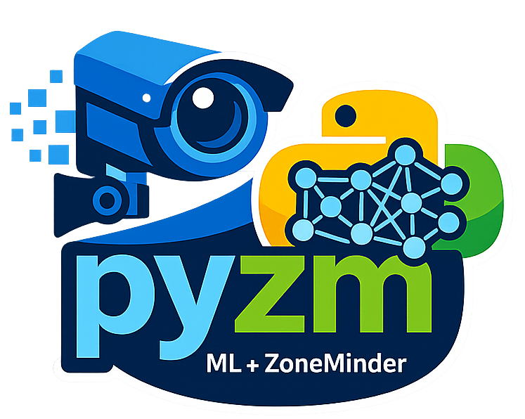

What
=====
pyzmv2 is a rewrite of pyzm.

It's a pythonic wrapper that integrates with ZM and also operates as a standalone ML library. Key features:
- ZM API
- ZM Event Server
- ZM Logger
- ZM Memory
- Machine Learning Modules (with our without ZM)

Installation
=============
See the [installation guide](https://pyzmv2.readthedocs.io/en/latest/guide/installation.html) on ReadTheDocs.

Documentation & Examples
=========================
Latest documentation is available <a href='https://pyzmv2.readthedocs.io/en/latest/'>here</a>. The documentation includes a full example.

Features
=========
- API auth using tokens or legacy (manages refresh logins automatically)
- Monitors
- Events with filters
- States
- Configs
- EventNotification callbacks
- Mapped Memory access
- Direct access to ML algorithms
- Remote ML detection server (`pyzm.serve`) — run models on a GPU box, detect from anywhere
- [Amazon Rekognition support](https://medium.com/@michael-ludvig/aws-rekognition-support-for-zoneminder-object-detection-40b71f926a80) for object detection

Training UI
============

pyzm includes a Streamlit-based UI for fine-tuning YOLO models on your own data:

```bash
streamlit run pyzm/train/app.py -- --base-path /var/lib/zmeventnotification/models
```

The `--base-path` flag points to your ZoneMinder models directory (defaults to `/var/lib/zmeventnotification/models`). Projects are stored in `~/.pyzm/training/`.

Testing
========

pyzm has three test tiers:

**Unit / integration tests** (no hardware required):
```bash
pip install pytest
python -m pytest tests/ -m "not e2e and not zm_e2e" -v
```

**ML end-to-end tests** (require real ML models on disk):
```bash
# Requires models in /var/lib/zmeventnotification/models/
# and the test image at tests/test_ml_e2e/bird.jpg (included in repo)
python -m pytest tests/test_ml_e2e/ -v

# Skip the slower remote-serve tests:
python -m pytest tests/test_ml_e2e/ -v -m "not serve"
```

**ZoneMinder end-to-end tests** (require a live ZM server):

One-time setup:
```bash
sudo pip install pytest --break-system-packages
cp tests/.env.zm_e2e.sample .env.zm_e2e   # edit with your ZM server details
```

```bash
# Readonly tests (auth, monitors, events, zones, frames, detection):
sudo -u www-data python -m pytest tests/test_zm_e2e/ -v -p no:cacheprovider

# Include write tests (event notes, stop/start/restart, DB tagging):
sudo -u www-data ZM_E2E_WRITE=1 python -m pytest tests/test_zm_e2e/ -v -p no:cacheprovider
```

ZM E2E tests auto-skip when `.env.zm_e2e` is missing, so `pytest tests/` is always safe.

Developer Notes (for myself)
=============================
To make a release:
```
./scripts/make_release.sh
```

To skip PyPI upload (e.g. package already published):
```
./scripts/make_release.sh --skip-pypi
```

To test a CHANGELOG:
```
# __version__ in pyzm/__init__.py should be updated
# replace v2.0.3 with whatever future version
GITHUB_TOKEN=$(gh auth token) git-cliff --tag "v2.0.3"
```

Limitations
============
* Only for Python3


